Configure Jenkins and Build the code,send it to Artifactory and then Deploy in k8s
-----------------------------------------------------------------------------------

* Create a one Instance for Jenkins Controller with Instance type is t2.micro\
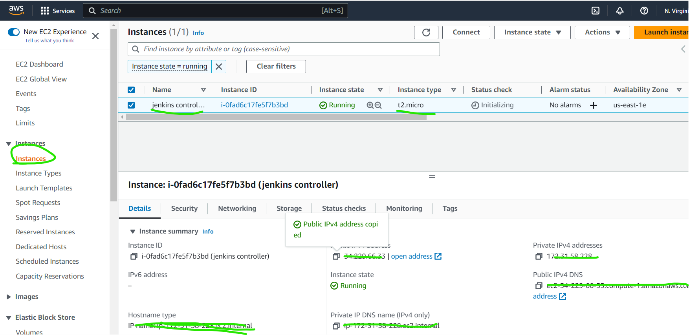
* Login into Machine and install the java and maven after that install jenkins in Long Term Support release
[refer here](https://www.jenkins.io/doc/book/installing/linux/#long-term-support-release) for the official docs of installing Jenkins on ubuntu.
* Execute the below steps in Jenkins Controller
```
sudo apt update
curl -fsSL https://pkg.jenkins.io/debian-stable/jenkins.io.key | sudo tee \
  /usr/share/keyrings/jenkins-keyring.asc > /dev/null
echo deb [signed-by=/usr/share/keyrings/jenkins-keyring.asc] \
  https://pkg.jenkins.io/debian-stable binary/ | sudo tee \
  /etc/apt/sources.list.d/jenkins.list > /dev/null
sudo apt install openjdk-8-jdk openjdk-17-jdk maven -y
sudo apt update
sudo apt install jenkins -y
```
* After installing jenkins we need to configure the jenkins controller on browser
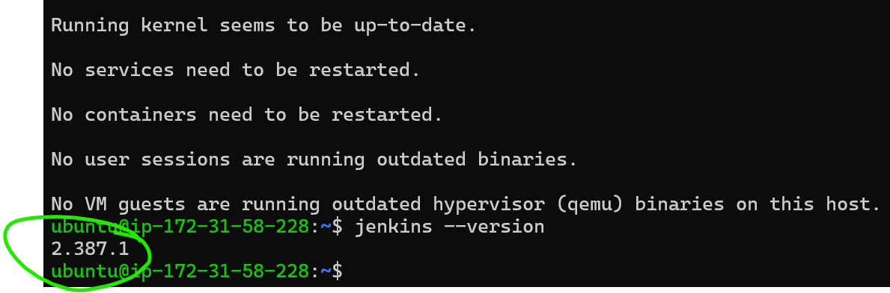
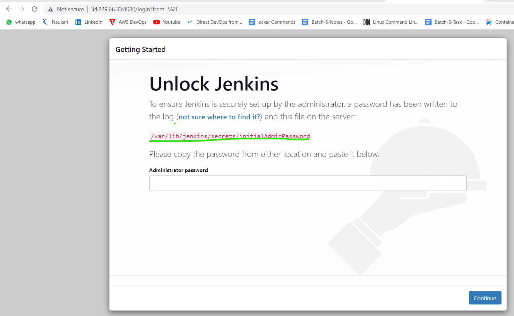
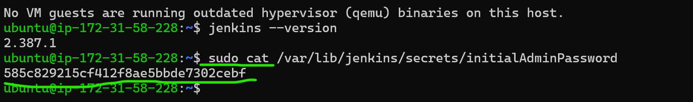
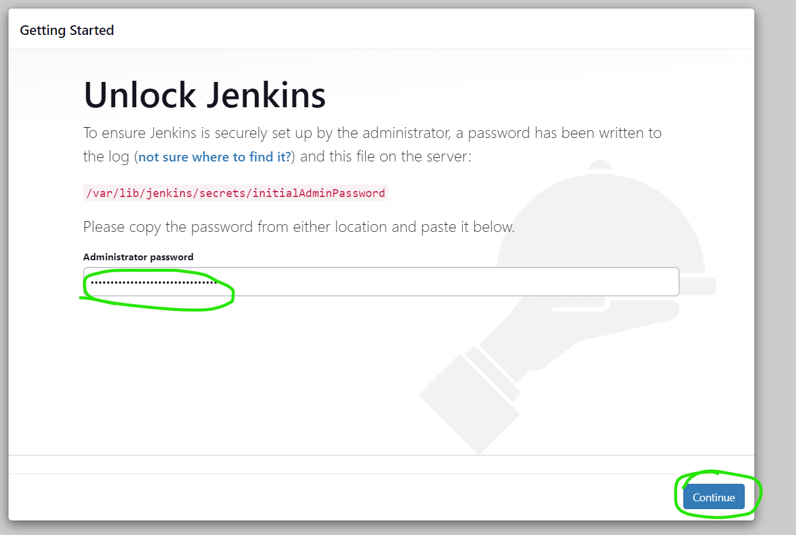
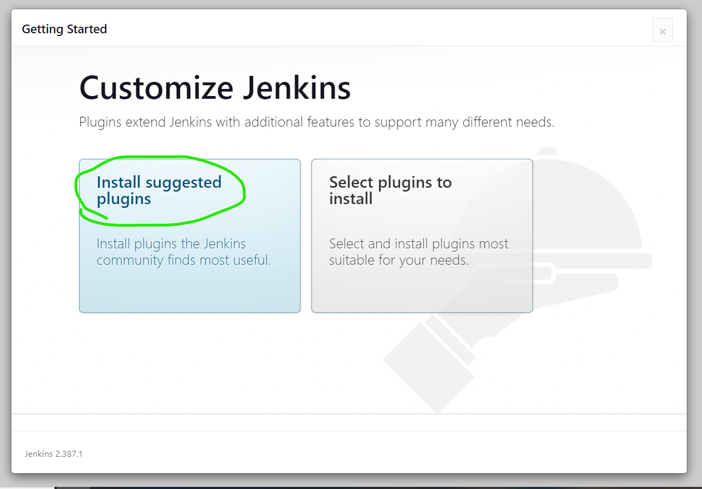
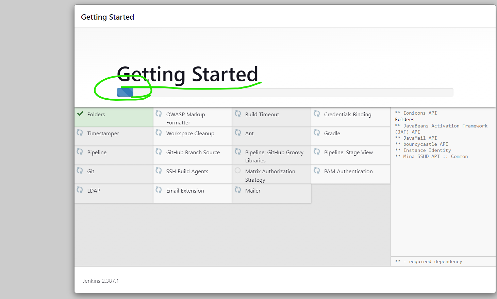
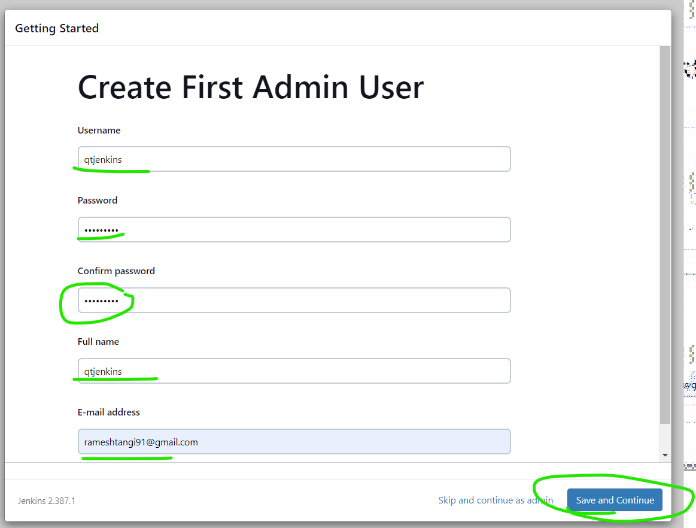
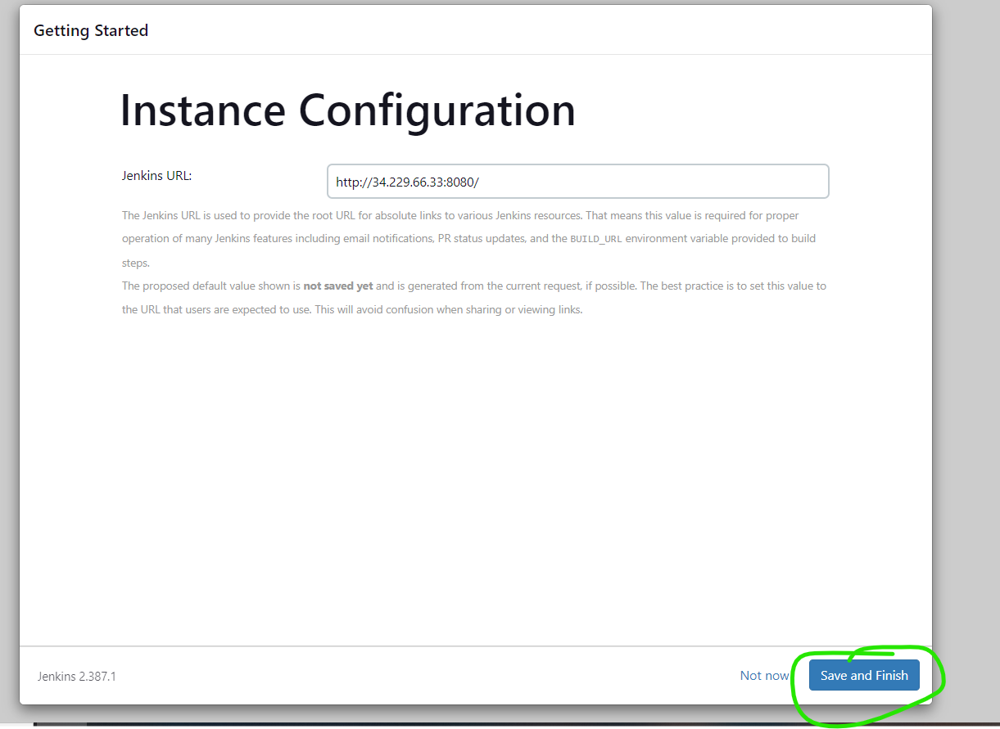
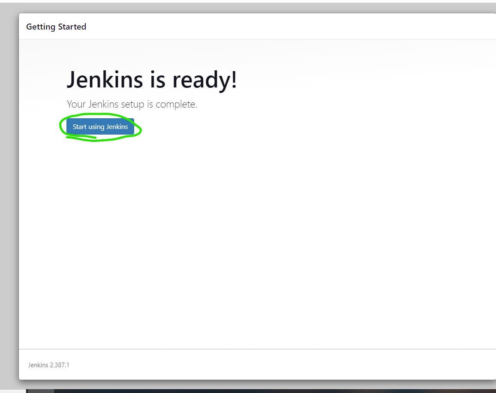
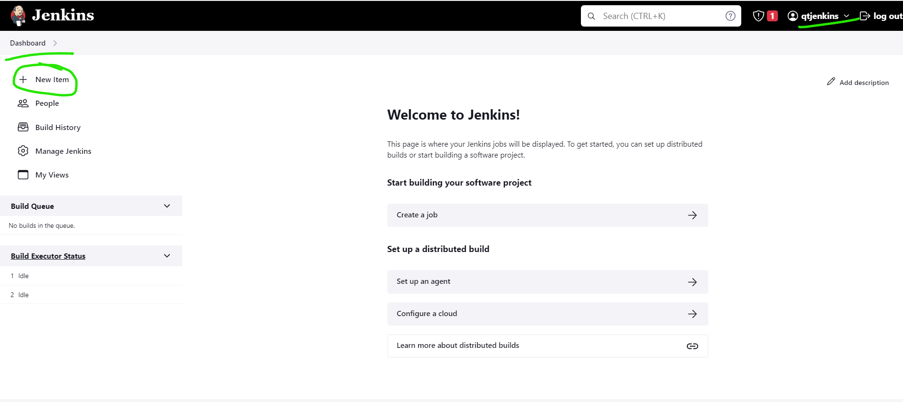


